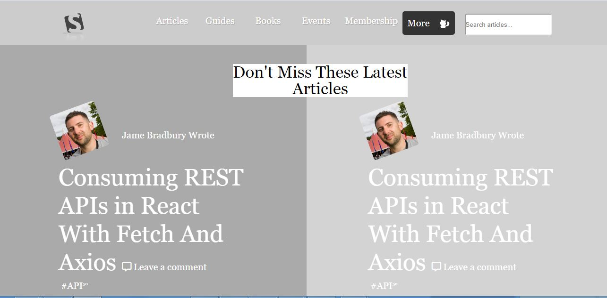

## Smashing Magazine

PROJECT:  DESIGN TEARDOWN

Project Design Screenshot : 


## Built With

- HTML5
- CSS3

## Live Demo

[Live Demo Link](https://rawcdn.githack.com/Alaska01/smashing-magazine-heatmap/98c97123b5a0d7e559c21f0919a26c570cb6e648/index.html)

# Getting Started 🚀

These instructions will get you a copy of the project up and running on your local machine.

## How To Use 🔧

From your command line, first clone the project:

```bash
# Clone this repository
$ git clone https://github.com/Alaska01/smashing-magazine-heatmap/tree/smashing-branch

# Go into the repository
$ cd apple-clone-branch


```

## CONTRIBUTORS
👤 **Kalu Agu Kalu**

- [Github]( https://github.com/Godswilly)
- [Twitter](https://twitter.com/KaluAguKalu17)
- [Linkedin](https://www.linkedin.com/in/kalu-agu-kalu/)

👤 **Aye Daniel A**

- [Github](https://github.com/Alaska01)
- [Twitter](https://twitter.com/AyeAsoo)
- [Linkedin](https://www.linkedin.com/in/daniel-asoo-aye-178500140/)

## Show your support

Give a ⭐️ if you like this project!

## Acknowledgments

- Thanks to Microverse and The Odin Project.

## 📝 License

This project is [MIT](lic.url) licensed.
